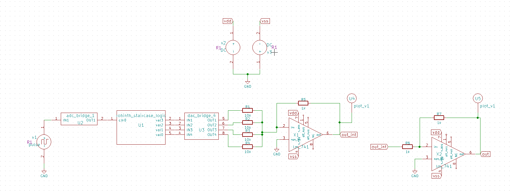
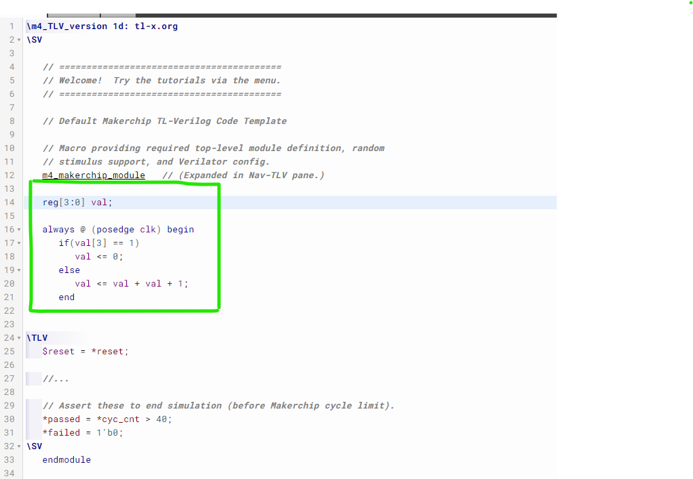
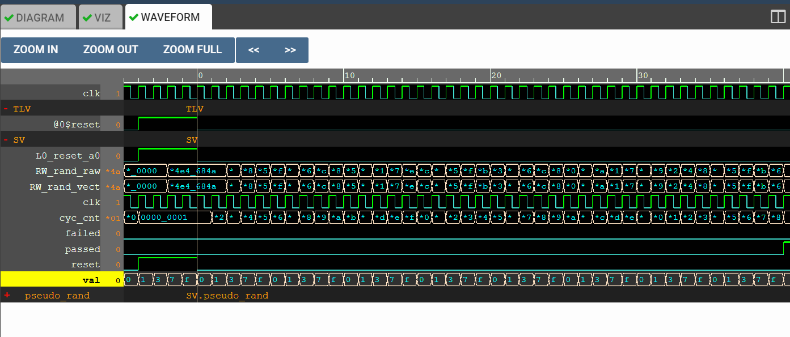
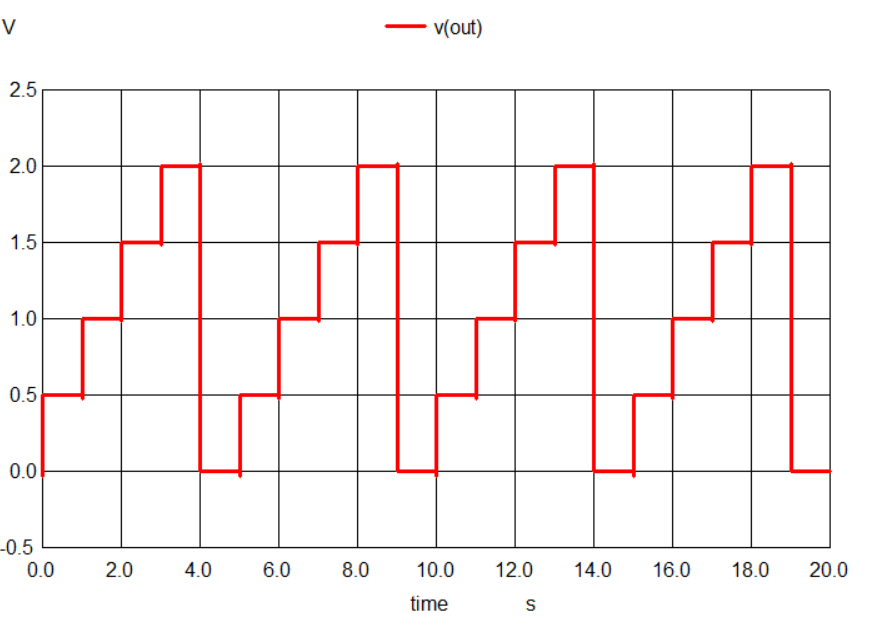

# Astable Multivibrator using Operational Amplifier


> **Aim:** To simulate a mixed signal circuit using analog and digital blocks with *eSim*

This repository presents a report for the *Mixed Signal Circuit Design and Simulation Marathon* using *eSim* implementing **Staricase Waveform Generator**


---

# Contents
- [Introduction](#introduction)
- [Description](#description)
- [Tools Used](#tools-used)
- [Run this project](#run-this-project)
- [Schematic](#schematic)
- [Makerchip](#makerchip)
- [Netlist](#netlist)
- [Output Waveform](#output-waveform)
- [Acknowlegements](#acknowledgements)
- [References](#references)


# Introduction
This repository presents the design of a Staircase wave generator circuit. A digital logic block is constructed which can provide logic level output for a staircase generation. An analog block which consists of opamp is the summing amplifier that adds all the output from the digital block so as to produce the necessary staircase output.

# Description
Staircase Waveform circuit is built using a digital logic block with output 0001, 0011, 0111, 1111, for a 4 level stairs circuit. The digital output is mapped to an analogous voltage pulses to make it work with the next analog block. Using positive logic, 1 is mapped to 1Volt and 0 to 0Volts. The pulse signal which is given as clock to the digital block is analog in nature which is converted to logic bits before the digital realization is done. The second block is a summing amplifier(inverting negative feedback) realized using opamp. As there are four output pins from the digital block, we consider here a summing amplifier that adds four different voltages. To the inverting terminal of the opamp, the four output from the digital logic block is connected using equal resistances.

# Tools used
> ### eSim 
> eSim (previously known as Oscad / FreeEDA) is a free/libre and open source EDA tool for circuit design, simulation, analysis and PCB design. It is an integrated tool built using free/libre and open source software such as KiCad, Ngspice, Verilator, makerchip-app, sandpiper-saas and GHDL. eSim is released under GPL.
> https://esim.fossee.in/home

- Tools used which are integrated to eSim
    - NgSpice - Open source Spice Simulator
    - Makerchip - Online  IDE for Verilog System-verilog/TL-Verilog Simulation.
    - Verilator - Conversion of Verilog code to C++ Objects

# Run this project
1. Clone this repository locally 
```
git clone https://github.com/rohinthram/esim_ms_staircase_wave.git
```
2. Go to *rohinth_staricase_wave* directory
```
cd rohinth_staircase_wave
```
3. Run NgSpice
```
ngspice rohinth_staircase_wave.cir.out
```

> **Note**: To work with eSim, open this folder *rohinth_staircase_wave* as project in eSim


# Schematic
> Circuit Designed using KiCad


- The digital block is the *rohinth_staircase_logic* which is built using the following verilog code
```verilog
module rohinth_staircase_logic(input clk,
			output reg[3:0] val);

	always @ (posedge clk) begin
		if(val[3] == 1)
			val <= 0;
		else
			val <= val + val + 1;
   	end

endmodule
```

- The analog block here is the two operational amplifiers, one adds all the digital output, the other inverts the output from the first opamp to give proper staircase output

# Makerchip
- The following is the code that is fed to the makerchip IDE

- The waveform for the above code is obtained as



# Netlist
- Netlist generated from KiCad to NgSpice Converter, which is sourced to NgSpice for simulation
```
* r:\esim_simulations\mixed_signal_hackathon\rohinth_staircase_wave\rohinth_staircase_wave.cir

.include lm_741.sub
v1  net-_u2-pad1_ gnd pulse(0 5 1m 1m 1m 0.5 1)
* u1  net-_u1-pad1_ net-_u1-pad2_ net-_u1-pad3_ net-_u1-pad4_ net-_u1-pad5_ rohinth_staircase_logic
* u2  net-_u2-pad1_ net-_u1-pad1_ adc_bridge_1
* u3  net-_u1-pad2_ net-_u1-pad3_ net-_u1-pad4_ net-_u1-pad5_ net-_r1-pad1_ net-_r2-pad1_ net-_r3-pad1_ net-_r4-pad1_ dac_bridge_4
x1 ? net-_r1-pad2_ gnd vss ? out_int vdd ? lm_741
r1  net-_r1-pad1_ net-_r1-pad2_ 10k
r2  net-_r2-pad1_ net-_r1-pad2_ 10k
r3  net-_r3-pad1_ net-_r1-pad2_ 10k
r4  net-_r4-pad1_ net-_r1-pad2_ 10k
r5  net-_r1-pad2_ out_int 1k
v2 vdd gnd  dc 15
v3 gnd vss  dc 15
* u4  out_int plot_v1
x2 ? net-_r6-pad2_ gnd vss ? out vdd ? lm_741
r6  out_int net-_r6-pad2_ 1k
r7  net-_r6-pad2_ out 1k
* u5  out plot_v1
a1 [net-_u1-pad1_ ] [net-_u1-pad2_ net-_u1-pad3_ net-_u1-pad4_ net-_u1-pad5_ ] u1
a2 [net-_u2-pad1_ ] [net-_u1-pad1_ ] u2
a3 [net-_u1-pad2_ net-_u1-pad3_ net-_u1-pad4_ net-_u1-pad5_ ] [net-_r1-pad1_ net-_r2-pad1_ net-_r3-pad1_ net-_r4-pad1_ ] u3
* Schematic Name:                             rohinth_staircase_logic, NgSpice Name: rohinth_staircase_logic
.model u1 rohinth_staircase_logic(rise_delay=1.0e-9 fall_delay=1.0e-9 input_load=1.0e-12 instance_id=1 ) 
* Schematic Name:                             adc_bridge_1, NgSpice Name: adc_bridge
.model u2 adc_bridge(in_low=1.0 in_high=2.0 rise_delay=1.0e-9 fall_delay=1.0e-9 ) 
* Schematic Name:                             dac_bridge_4, NgSpice Name: dac_bridge
.model u3 dac_bridge(out_low=0.0 out_high=5.0 out_undef=0.5 input_load=1.0e-12 t_rise=1.0e-9 t_fall=1.0e-9 ) 
.tran 1e-00 20e-00 0e-00

* Control Statements 
.control
run
print allv > plot_data_v.txt
print alli > plot_data_i.txt
set color0=white;
set color1=black;
set color2=red;
set xbrushwidth=3;
plot v(out_int)
plot v(out)
.endc
.end

```

# Output Waveform
> The following is the staircase waveform generated from the circuit implemented


# Report By
 - R.V.Rohinth Ram

# Acknowledgements
- FOSSEE, IIT Bombay
- Steve Hoover, Founder, Redwood EDA
- Kunal Ghosh, Co-founder, VLSI System Design (VSD) Corp. Pvt. Ltd. - kunalpghosh@gmail.com
- Sumanto Kar, eSim Team, FOSSEE

# References
[1] S. Franco, *Design with operational amplifiers and analog integrated
circuits*, vol. 1988. McGraw-Hill New York, 2002.

---
